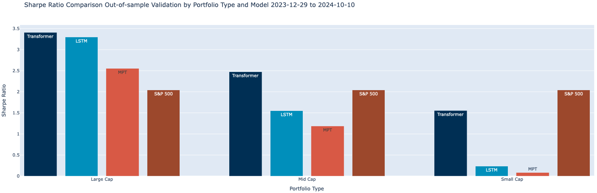
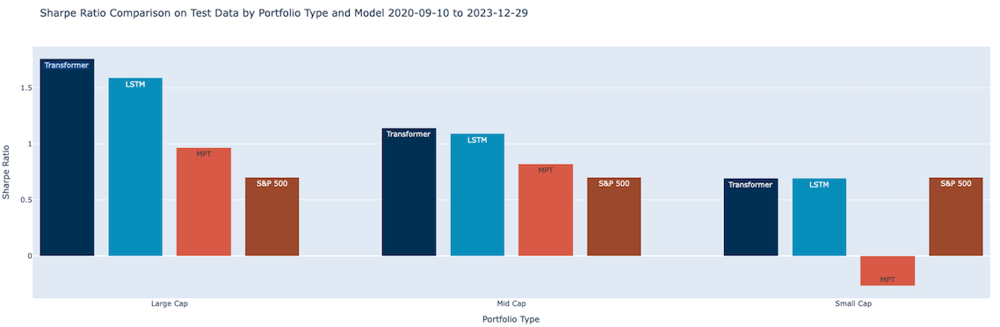

# LSTM and Transformer Models for Financial Portfolio Optimization

This section of the repository focuses on deep learning techniques applied to financial portfolio optimization. The primary aim is to enhance portfolio performance by using machine learning models such as Long Short-Term Memory (LSTM) networks and Transformers to predict future asset prices and optimize portfolio allocations.

## Overview

* **LSTM Models**: LSTMs are designed to capture long-term dependencies in sequential data, making them ideal for financial time series forecasting. By analyzing historical asset prices, the LSTM models aim to forecast future returns, providing a basis for dynamically adjusting portfolio weights.

* **Transformer Models**: Transformers, originally used for natural language processing, have recently been adapted for time-series forecasting. These models can capture complex relationships between different time points, offering a powerful alternative to LSTMs in predicting asset prices and improving portfolio optimization.

## Key Features:

* **Data Preprocessing**: Financial data is sourced from Yahoo Finance and prepared for deep learning models. The data is normalized and split into training, validation, and test sets.

* **LSTM Model Architecture**: The LSTM network consists of layers designed to handle sequential financial data, followed by dense layers to predict future asset returns.

* **Transformer Model Architecture**: The Transformer models include multi-head attention layers, feed-forward networks, and positional encoding to capture the structure and patterns in the financial time-series data.

* **Portfolio Optimization**: Predicted returns from LSTM and Transformer models are used to optimize portfolio allocations, aiming to maximize the Sharpe Ratio by adjusting weights based on the forecasted returns.

* **Model Evaluation**: Both models are evaluated on out-of-sample data, comparing their performance in terms of annualized returns, volatility, and Sharpe Ratio. The performance is benchmarked against Modern Portfolio Theory (MPT) optimization and the S&P 500 index.

## Results and conclusions

After training and evaluating the models, a comparison between LSTM, Transformer, and MPT is presented. Metrics such as Sharpe Ratio, annualized returns, and volatility are compared across different portfolios (Large Cap, Mid Cap, Small Cap). The performance is also benchmarked against the S&P 500.

### Test Results

The graph below represents the Sharpe Ratio comparison from the test data, covering the period from 2020-09-10 to 2023-12-29:

<p align="center">
  
</p>


### Out-of-Sample Results

The graph below shows the Sharpe Ratio comparison between Transformers, LSTMs, MPT, and the S&P 500 for the period 2023-12-29 to 2024-10-10:

<p align="center">
  
</p>


### Key Findings

* **Large Cap Portfolios**: Transformers achieved the highest Sharpe Ratio in the out-of-sample period, surpassing LSTMs and MPT. In the test period, LSTMs and Transformers performed similarly.

* **Mid Cap Portfolios**: Transformers showed stronger performance than LSTMs and MPT in both the out-of-sample and test periods.

* **Small Cap Portfolios**: While the results were less impressive across all models, the S&P 500 consistently outperformed the models on risk-adjusted returns. MPT, in particular, struggled in both periods.

## How to Run

1.	Clone the repository:

```bash
git clone https://github.com/MorganneDeWitte/Financial-Portfolio-Optimizer.git
```

2.	Install the required Python packages:

Make sure you have pip installed. Then, you can install all the necessary dependencies using the following command:

```bash
pip install -r requirements.txt
```

3.	Run the Jupyter Notebooks