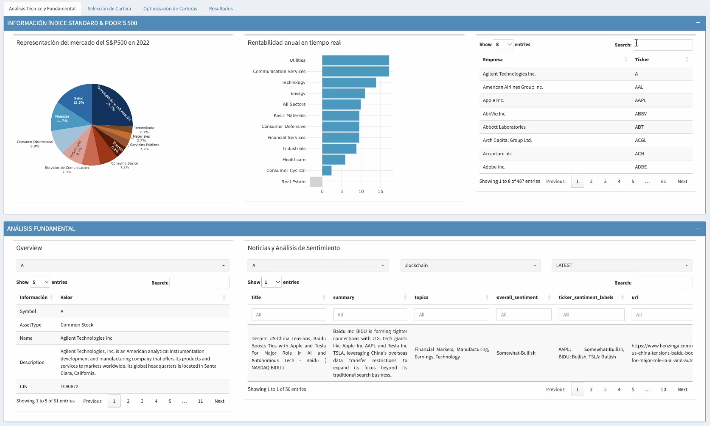
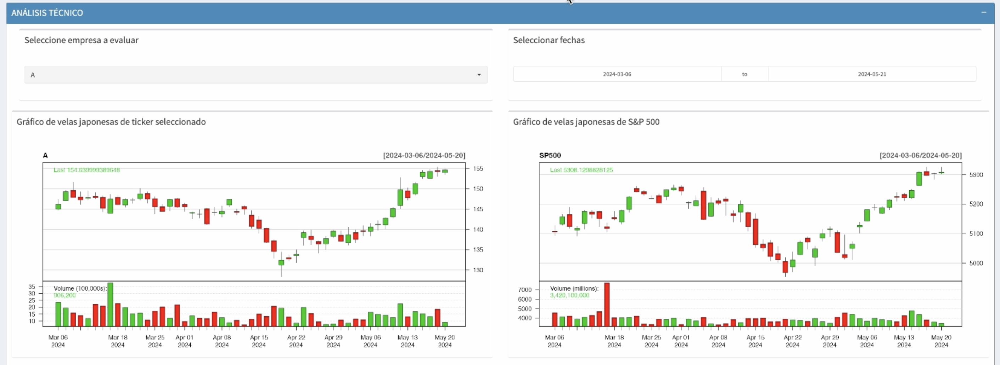
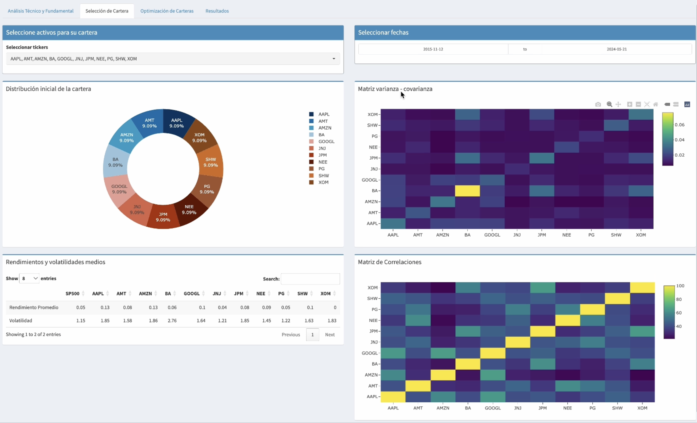
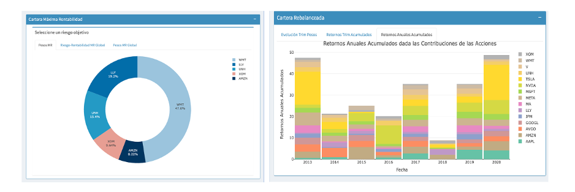
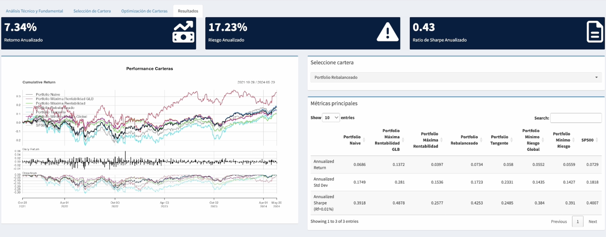

# Portfolio Optimization Shiny App

This **Shiny web application** has been developed to facilitate portfolio management and decision-making for users. The app offers various investment strategies based on Harry Markowitz’s **Modern Portfolio Theory (MPT)**, providing the opportunity to analyze portfolio performance based on return, volatility, and Sharpe ratio.

The app allows users to:

* Select assets to create personalized portfolios.
* Optimize portfolios using different approaches, including maximized returns, minimized risk, and maximized Sharpe ratio.
* Compare portfolio performance to the S&P 500 index.

An in-depth analysis has been carried out using the app, comparing the effectiveness of optimizations across portfolios consisting of **Large Cap, Mid Cap, and Small Cap stocks**. Results indicate that Large Cap and Mid Cap assets outperformed the S&P 500 in terms of profitability and Sharpe ratio, and in some cases, even exhibited lower volatility.

## User interface 

#### Technical and Fundamental Analysis Tab
---

<p>
  
</p>

<p>
  
</p>


#### Portfolio Selection Tab
---

<p>
  
</p>

----

#### Portfolio Optimization Tab
---

(Only showing two optimization strategies)
<p>
  
</p>

#### Results Tab
---

<p>
  
</p>


## Technologies Used 

The following R packages were utilized in the development of the app:

* **Quantmod**: provides easy access to financial data. In this case, the function getSymbols() was used to fetch the historical daily returns of stocks from Yahoo Finance.
* **PortfolioAnalytics**:

    * This package offers tools for portfolio analysis and optimization. The portfolios were created with portfolio.spec, which allows users to define the assets. Afterward, various objectives and constraints were applied:
        * Return: For maximum return or maximum Sharpe ratio portfolios, this objective is crucial, defined using the mean returns.
        * Risk: Used for minimum risk and maximum Sharpe ratio portfolios, where standard deviation was used as the measure of risk.
        * Risk Budget (CVaR): Used to limit the risk of extreme losses, where Conditional Value at Risk (CVaR) ensures that no individual asset contributes more than 20% to the portfolio’s total risk during extreme market events (above the 95th percentile).
        * Constraints: All portfolios invest 100% of available funds, and no short selling is allowed, assuming that investors are betting on the rise in asset prices.

* **ROI (R Optimization Infrastructure)**: Used for optimization. This package provided the infrastructure for solving the optimization problems using Markowitz Portfolio Theory.

* **PerformanceAnalytics**: This package was utilized to calculate key performance metrics, such as annualized returns, volatility, and the Sharpe ratio for the optimized portfolios.

* **Alphavantager**: Provides access to financial data through an API. In this project, it was used for fundamental analysis of stocks, offering real-time company news and sentiment analysis.

* **Rvest**: Extracted data from HTML and XML pages for scraping financial information from websites.

* **Shiny, ShinyDashboard, and ShinyWidgets**: Shiny is the core framework used to develop the web application. ShinyDashboard and ShinyWidgets were employed to create an interactive and user-friendly dashboard, featuring selectors, buttons, graphs, and tables for easy decision-making and visualization of portfolio performance.


## How to Run

> [!IMPORTANT]
> Ensure that the [data file](./data/ticker_empresa.xlsx) is saved and loaded correctly, as it's essential for the proper functioning of the application.
> To use the fundamental analysis features, you will need to obtain an API key from [AlphaVantage](https://www.alphavantage.co/support/#api-key). Make sure to add this key to the appropriate environment variables or configuration files before running the application.

1.	Clone the repository:

```bash
git clone https://github.com/MorganneDeWitte/Financial-Portfolio-Optimizer.git
```

2.	Install the following R packages

```bash
required_packages <- c("quantmod", "TTR", "ggplot2", "RColorBrewer", "PortfolioAnalytics", "dplyr", "matrixStats", "plotly", "tidyr", "lubridate", "shinydashboard", "shinyWidgets", "readxl", "DT", "alphavantager", "jsonlite", "rvest", "ROI", "ROI.plugin.glpk", "PerformanceAnalytics")

new_packages <- required_packages[!(required_packages %in% installed.packages()[,"Package"])]
if(length(new_packages)) install.packages(new_packages)
```

3. Run the Shiny app locally:

```bash
library(shiny)
runApp('path_to_your_shiny_app')
```